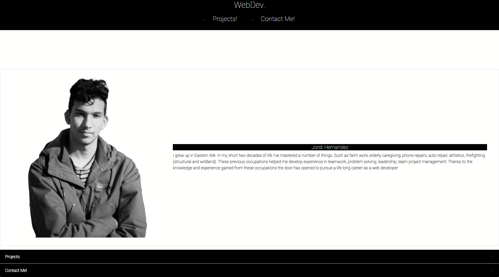

# About Jordi
I grew up in Eastern WA. In my short two decades of life I've mastered a number of things. Such as farm work, elderly caregiving, phone repairs, auto repair, athletics, firefighting (structural and wildland). These previous occupations helped me develop experience in teamwork, problem solving, leadership, team project management. Thanks to the knowledge and experience gained from these occupations the door has opened to pursue a life long career as a web developer.

## Included in Portfolio
At least 3 Projects

Links to GitHub Profile, Repos, & LinkedIn

Link to Download Resume or open in new tab

Contact Jordi Page with methods of contacting

## Screenshot of Page

## Links
Deployed Page: https://hernajor133.github.io/web-dev-success-portfolio/

GitHub Repo: https://github.com/hernajor133/web-dev-success-portfolio.git